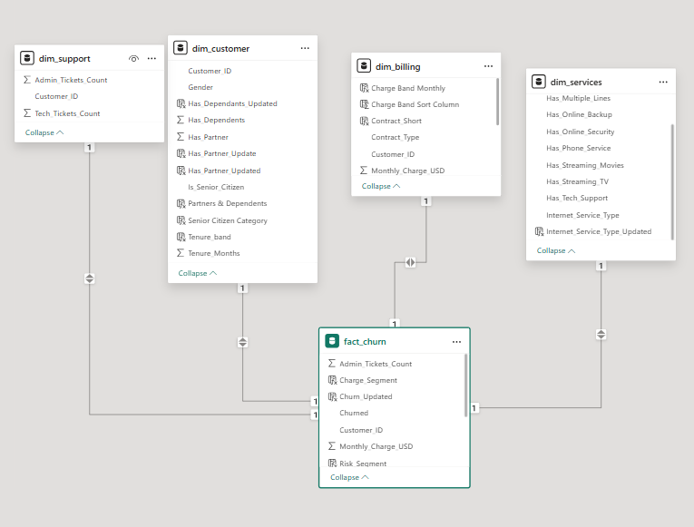
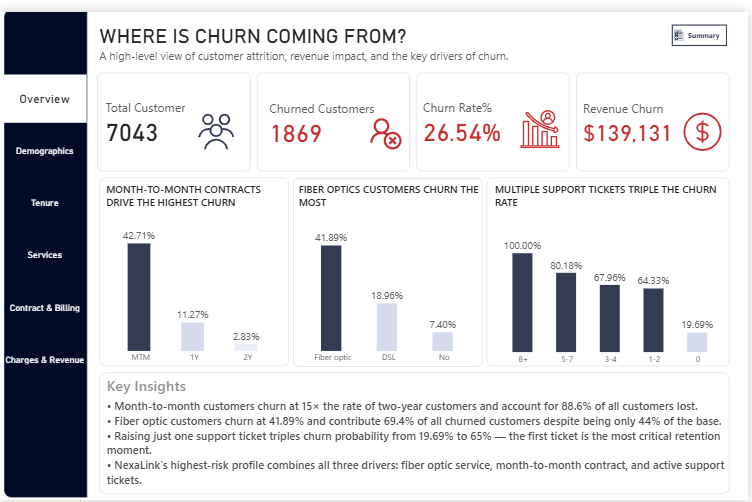
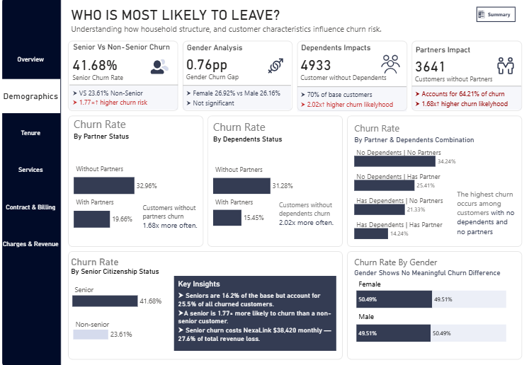
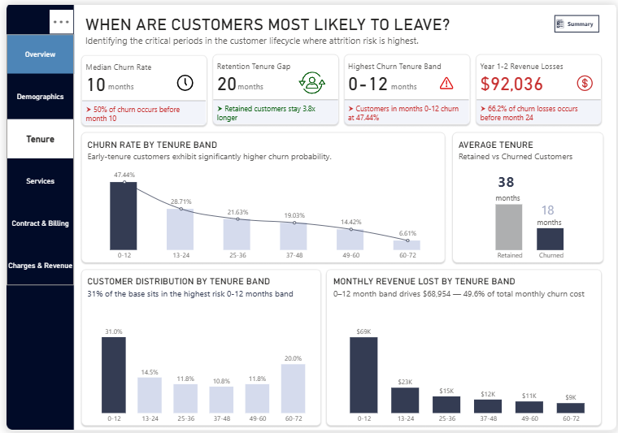
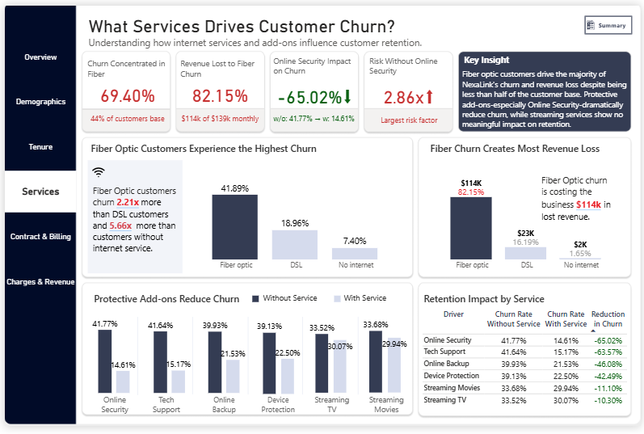
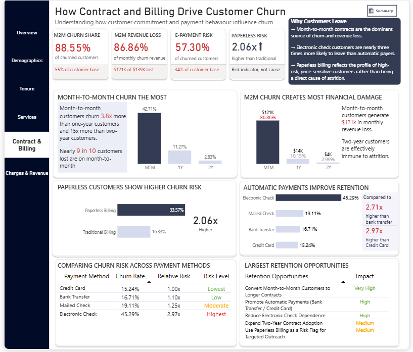
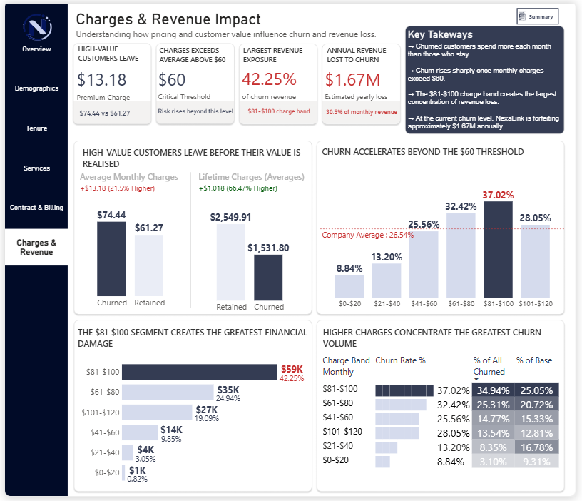

# NexaLink Telecom — Customer Churn Analysis & Retention Strategy

> **End-to-end analytics project** investigating why customers leave, how much it costs, and what NexaLink should do about it — across 7,043 customers, 7 analytical dimensions, and $1.67M in annual revenue at risk.

---

## The Business Problem

NexaLink is a residential telecom provider offering internet, phone, and streaming services. The company faces a structural attrition crisis: **26.5% of its 7,043-customer base has churned** — above the 18–25% industry norm — resulting in **$139,131 in monthly recurring revenue loss**, equivalent to **30.5% of total monthly revenue** and **$1.67M annualised**.

What makes this worse: churned customers pay **21.5% more per month** ($74.44 vs. $61.27 average) than retained ones. NexaLink is not losing its low-value accounts — it is losing its best customers.

| Metric | Value |
|--------|-------|
| Total customers | 7,043 |
| Churned customers | 1,869 (26.5%) |
| Monthly revenue lost | $139,131 |
| % of total monthly revenue | 30.5% |
| Annualised revenue lost | **$1,669,570** |
| Avg. monthly charge — churned | $74.44 |
| Avg. monthly charge — retained | $61.27 |
| Avg. lifetime value — churned | $1,531.80 |

---

## Tools & Technical Stack

| Tool | Usage |
|------|-------|
| **Power BI** | Dashboard design, DAX measures (20+), semantic model, star schema |
| **Microsoft Excel** | Data source, schema design, data preparation |
| **DAX** | Churn rate calculations, revenue impact measures, segment comparisons, compound risk logic |
| **GitHub** | Version control and portfolio publishing |

---

## Data Model

Star schema — one fact table and four dimension tables, all joined on `Customer_ID`:

| Table | Type | Key Columns |
|-------|------|-------------|
| `fact_churn` | Fact | Customer_ID, Monthly_Charge_USD, Churned, Tenure_Months, Ticket counts |
| `dim_customer` | Dimension | Customer_ID, Gender, Senior_Citizen, Has_Partner, Has_Dependents |
| `dim_billing` | Dimension | Customer_ID, Contract_Type, Payment_Method, Paperless_Billing |
| `dim_services` | Dimension | Customer_ID, Internet_Service_Type, Add-on subscriptions |
| `dim_support` | Dimension | Customer_ID, Admin_Tickets_Count, Tech_Tickets_Count |



> **Design note — One-to-one cardinality:** The one-to-one relationships in this model are intentional. The source data was a single wide customer table split into logical subject areas (demographics, billing, services, support) for analytical clarity. Each customer has exactly one row in every table — this is a customer-level snapshot, not a transactional fact table. One-to-one simplifies the model and avoids ambiguous filter propagation that bidirectional one-to-many relationships introduce.

---

## Dashboard

Six pages, each targeting a specific decision question:

| Page | Decision Question |
|------|------------------|
| Overview | What is the scale of our churn problem and where does it concentrate? |
| Demographics | Which customer profiles are most at risk by age, household, and gender? |
| Tenure & Loyalty | When in the customer lifecycle does churn peak — and what is the intervention window? |
| Services & Add-ons | Which services retain customers and which have no loyalty effect at all? |
| Contract & Billing | How do contract type, payment method, and billing format drive structural churn risk? |
| Charges & Revenue | Where is the financial exposure concentrated, and what is the revenue impact by segment? |

### Overview


### Demographics


### Tenure & Loyalty


### Services & Add-ons


### Contract & Billing


### Charges & Revenue


---

## Analysis Framework

Every section of this project follows a structured framework:

**Observation → Insight → Impact → Recommendation**

This prevents analysis from stopping at description ("fiber optic customers churn more") and forces it forward to causality, financial quantification, and business action. Both **churn rate** (the % of a segment that churns) and **churn volume** (the absolute number of churned customers) are tracked throughout — a segment with a moderate rate but large base can still drive more total churn than a high-rate niche segment.

---

## Key Findings

### 1. Contract Type is the Single Strongest Churn Predictor

Month-to-month customers churn at **42.7%** — **15.3 times** the rate of two-year contract customers (2.8%). They account for **88.6% of all churn** and **86.9% of total monthly revenue loss ($120,847/month)** despite being only 55% of the customer base.

| Contract Type | Churn Rate | % of Total Churn | Monthly Revenue Lost | Multiplier vs. Two-year |
|--------------|-----------|-----------------|---------------------|------------------------|
| Month-to-month | **42.7%** | 88.6% | $120,847 | **15.3x** |
| One year | 11.3% | 8.8% | ~$14,900 | 4.0x |
| Two year | **2.8%** | 2.6% | ~$3,900 | 1.0x (baseline) |

**Why:** Month-to-month customers face zero switching costs — no early termination fees, no paperwork barriers, no financial penalty. Any dissatisfaction, price sensitivity, or competitor offer translates immediately into departure.

**Implication:** Converting even 15–20% of month-to-month customers to annual contracts would structurally eliminate a disproportionate share of churn. This is NexaLink's highest-leverage commercial intervention.

---

### 2. A Single Tech Support Ticket Triples Churn Probability

The sharpest inflection point in the entire dataset: customers with zero tech tickets churn at **19.7%**. After raising just one ticket, churn jumps to **65.6%** — a **3.33x multiplier** and a 46 percentage point increase.

| Tech Tickets | Churn Rate | Multiplier vs. 0 Tickets |
|-------------|-----------|------------------------|
| 0 | 19.7% | 1.0x (baseline) |
| **1** | **65.6%** | **3.33x** |
| 2 | 70.0% | 3.55x |
| 3 | 75.0% | 3.81x |
| 5 | 80.0% | 4.06x |
| 7 | 96.6% | 4.90x |
| 8–9 | 100.0% | 5.08x |

**Why it matters:** The moment a customer raises a ticket is NexaLink's most critical individual retention opportunity. The first-ticket moment is the intervention window — not the fourth or fifth.

---

### 3. Compound Risk: High Charges + High Tickets = 78.9% Churn

When two risk factors coexist in the same customer, the churn rate does not add — it compounds.

| Risk Factor | Churn Rate | Additive Prediction | Actual Combined |
|-------------|-----------|-------------------|----------------|
| Neither (baseline) | 16.8% | — | — |
| High charges only (>$70.35) | 26.9% | — | — |
| High tickets only (2+) | 41.7% | — | — |
| **Both factors** | — | ~52% (additive) | **78.9%** |

**558 customers (7.9% of base)** sit in this compound-risk segment. They account for **23.5% of all churn** and churn at **4.69 times** the baseline rate.

---

### 4. Fiber Optic Customers Are NexaLink's Most Vulnerable Segment

| Internet Type | Churn Rate | % of Total Churn | Concentration Index |
|--------------|-----------|-----------------|---------------------|
| **Fiber optic** | **41.9%** | **69.4%** | **1.58x** |
| DSL | 19.0% | 24.6% | 0.72x |
| No internet (phone only) | 7.4% | 6.0% | 0.28x |

Fiber optic customers pay NexaLink's highest charges yet churn at its highest rate — a signal that the service experience is not meeting expectations relative to its premium price point.

---

### 5. Electronic Check Users Churn at 2.7–3.0x the Rate of Autopay Customers

| Payment Method | Churn Rate | % of Total Churn | Multiplier vs. Autopay |
|---------------|-----------|-----------------|----------------------|
| **Electronic check** | **45.3%** | **~60%** | **2.7–3.0x** |
| Mailed check | 19.1% | ~5% | 1.2x |
| Bank transfer (automatic) | 16.7% | ~17% | 1.0x (baseline) |
| Credit card (automatic) | 15.2% | ~17% | 0.9x |

**Why:** Automatic payments create a "set-and-forget" effect — customers do not actively reconsider the service each month. Electronic check users must engage with their bill directly, making them more aware of costs and more responsive to competitor offers.

---

### 6. Protective Add-ons Cut Churn by More Than Half

| Add-on Service | Churn Rate (Without) | Churn Rate (With) | Gap | Multiplier |
|---------------|---------------------|-------------------|-----|-----------|
| Online Security | 41.8% | **14.6%** | 27.2 p.p. | **2.86x** |
| Tech Support | 41.6% | **15.2%** | 26.4 p.p. | **2.74x** |
| Device Protection | ~38% | ~19% | 18.4 p.p. | 2.00x |
| Online Backup | ~37% | ~20% | 16.6 p.p. | 1.85x |

Yet over **60% of internet customers lack each protective add-on**. This is NexaLink's most underutilised retention lever — the majority of the customer base is unprotected.

**Streaming services, by contrast, provide virtually no retention benefit** (3.4–3.8 percentage point gap for TV and Movies). Customers will not stay for Netflix-equivalent services if dissatisfied with the core product.

---

### 7. Churn is Primarily a First-Year Problem

| Tenure Band | Churn Rate | % of Total Churn | Concentration Index |
|------------|-----------|-----------------|---------------------|
| **0–12 months** | **47.4%** | **55.5%** | **1.79x** |
| 13–24 months | 28.7% | 16.2% | 1.08x |
| 25–36 months | 21.6% | 9.8% | 0.82x |
| 37–48 months | ~17.0% | 7.1% | 0.64x |
| 49–60 months | ~11.0% | 4.1% | 0.42x |
| 61–72 months | 6.6% | 5.2% | 0.25x |

**More than half of all customers who will ever churn do so within the first 12 months.** By the two-year mark, 71.7% of eventual churn has already occurred. Churned customers had an average tenure of 18.0 months vs. 37.6 months for retained customers.

---

### 8. Demographic Risk: Household Embeddedness, Not Gender

Gender carries no predictive weight (26.9% female vs. 26.2% male — a 0.7 percentage point gap). The real demographic driver is household stability:

| Household Profile | Churn Rate | Multiplier vs. Baseline |
|------------------|-----------|------------------------|
| With partner + with dependents | 14.2% | 1.0x (baseline) |
| With partner, no dependents | ~27% | 1.90x |
| No partner, with dependents | ~29% | 2.04x |
| **No partner, no dependents** | **34.2%** | **2.41x** |

Customers with dependents and partners face higher switching costs — shared accounts, bundled services, and greater disruption risk — which anchors them to the service. Single, independent customers have no such friction.

**Senior citizens** churn at **41.7%** (1.77x the rate of non-seniors) despite being only 16% of the base. A digital-first service delivery model and online self-service support likely creates a product-market fit gap for this demographic.

---

## Cross-Dimensional Compound Risk

The most dangerous customer profiles — combining multiple risk factors:

| Profile | Est. Churn Rate | Est. Customers | Priority |
|---------|-----------------|---------------|----------|
| Month-to-month + electronic check + 2+ tickets | **~52–55%** | ~500 | **Critical** |
| Month-to-month + electronic check + senior, no add-ons | **~55%** | ~80 | **Critical** |
| Fiber optic + no add-ons + month-to-month | **~48–50%** | ~1,500 | **Critical** |
| Senior + no dependents + month-to-month | **~48–50%** | ~250 | **High** |

The most protected profile: **two-year contract + automatic payment + online security/tech support** → **~2–3% churn rate**. Every intervention is designed to move customers toward this profile.

---

## Retention Recommendations & ROI

### Priority Ranking

| Priority | Initiative | Target Segment | Est. Annual Cost | Est. Annual Benefit | Net ROI |
|----------|-----------|---------------|-----------------|---------------------|---------|
| 1 | Contract conversion programme | 3,874 MTM customers | $120K–$350K | $504K–$1.36M | **$384K–$1.01M** |
| 2 | First-ticket escalation workflow | ~970 ticket-raisers/year | $70K–$120K | $180K–$264K | **$110K–$144K** |
| 3 | Autopay migration campaign | ~2,370 electronic check users | $60K–$120K | $106K–$210K | **$46K–$90K** |
| 4 | Protective add-on bundling | ~1,900 unprotected fiber customers | $50K–$120K | $112K–$138K | **$62K–$68K** |
| 5 | First-year onboarding programme | ~2,180 new customers/year | $90K–$160K | $240K–$360K | **$150K–$200K** |
| 6 | Senior retention programme | ~1,140 senior customers | $30K–$60K | $75K–$150K | **$45K–$90K** |
| 7 | Compound-risk segment outreach | 558 high-charge + high-ticket | $20K–$30K | $75K–$100K | **$55K–$80K** |

**Portfolio total (conservative):** Investment $440K–$960K → Benefit $1.29M–$2.58M → **ROI 1.3x–3.8x in Year 1**

---

### Priority 1 — Contract Conversion Programme

Month-to-month customers account for 88.6% of all churn and $120,847 in monthly revenue loss. Converting even 15% of them to annual contracts would recover an estimated **$504,000 annually**.

**Phased action plan:**
- **Month 1–2:** Offer all MTM customers one-month bill credit to upgrade to a one-year contract ($120K–$200K one-time cost, 15–20% expected conversion)
- **Month 1–3:** Enhanced incentive campaign targeting the highest-risk subsegment: MTM + electronic check + paperless billing (~1,200 customers at 48.3% churn, responsible for ~$43,000/month in losses)
- **Month 2–4:** Offer MTM → two-year conversion with first year of tech support bundled free
- **Month 3+:** Embed contract upgrade into the standard 6-month tenure check-in workflow

---

### Priority 2 — First-Ticket Escalation Workflow

A single tech ticket triples churn. The intervention must happen at ticket one — not after the customer has already decided to leave.

**Action plan:**
- Automatic CRM workflow: first tech ticket raises a retention flag within 24 hours
- Route single-ticket customers to a retention-specialist agent (not a standard support queue)
- Offer complimentary tech support subscription at the point of first contact
- Proactively identify and fast-track the 558 compound-risk customers (78.9% churn)

---

### Priority 3 — Autopay Migration

Electronic check users churn at 45.3% — nearly triple the rate of autopay users — and account for ~60% of all churned customers.

**Action plan:**
- $5/month autopay discount for all electronic check customers who switch
- Targeted campaign to the highest-risk subsegment: electronic check + month-to-month
- Embed autopay enrolment into the new customer onboarding flow (targeting 60–70% autopay from day one)

---

### Priority 4 — Protective Add-on Bundling

Online security cuts churn by 27 percentage points (41.8% → 14.6%). Tech support cuts it by 26 points. Yet 60%+ of internet customers have neither.

**Action plan:**
- Bundle online security + tech support with all new fiber optic subscriptions (first 6 months free)
- Run upsell campaign to ~1,900 existing unprotected fiber customers at $5–10/month for both services
- Create a "protected customer" retention tracking segment for ongoing monitoring

---

## Analytical Decisions & Methodology Notes

**Churn rate vs. churn volume dual tracking:** A segment with a high churn rate but small base may produce fewer total departures than a moderate-rate, large segment. Both metrics are tracked throughout to avoid misallocating retention resources to small high-rate niches while ignoring large moderate-rate segments.

**Correlation-causation distinction:** Paperless billing customers churn at 33.6% vs. 16.3% for traditional billing — a 2.06x multiplier. However, controlling for contract type eliminates most of the effect (two-year paperless customers churn at just 4.2%). Paperless billing is a **risk indicator**, not a cause — it flags a customer profile disproportionately concentrated in month-to-month contracts and fiber optic plans. Treating it as a cause would lead to the wrong intervention.

**Why the one-to-one star schema:** The original dataset was a single wide customer table. Splitting it into subject-area tables (demographics, billing, services, support) improves analytical clarity and filterability in Power BI without introducing the ambiguous cross-filtering risks of one-to-many bidirectional relationships on non-transactional data.

---

## Repository Structure

```
NexaLink-Churn-Analysis/
│
├── README.md
│
├── Data/
│   ├── Raw/
│   │   └── Customer_Churn_Dataset.xlsx
│   └── Processed/
│       └── NexaLink_Churn_PowerBI.xlsx
│
├── Dashboard/
│   └── NexaLink_Project.pbip
│
├── Report/
│   └── NexaLink_Churn_Analysis_Report.md    ← Full detailed breakdown by dimension
│
└── Assets/
    └── Screenshots/
        ├── Overview.png
        ├── Demographics.png
        ├── Tenure.png
        ├── Services.png
        ├── Contract&Billing.png
        ├── Charges&Revenue.png
        └── image.png
```

**For the full dimension-by-dimension breakdown** — including all segmentation tables, charge threshold analysis, cumulative churn curves, and complete recommendation action plans — see [`Report/NexaLink_Churn_Analysis_Report.md`](Report/NexaLink_Churn_Analysis_Report.md).

---

## How to Access the Dashboard

**Open locally:**
1. Clone this repository
2. Open Power BI Desktop
3. Use **File → Open** and select `NexaLink_Project.pbip` from the Dashboard folder
4. In Power Query (**Transform Data → Data Source Settings**), update the Excel source path to match your local file location

**Publish to Power BI Service:**
- Open the `.pbip` project in Power BI Desktop
- Use **Publish** to push to your Power BI workspace
- Share the resulting report link for browser-based access (no Power BI Desktop required)

---

## Author

**Akinfisoye Erioluwa** — Data Analyst

[LinkedIn](https://www.linkedin.com/in/erioluwa-akinfisoye-30533a247/) | [GitHub](https://github.com/Eri-akinfisoye)

Specialising in customer analytics, churn analysis, revenue impact modelling, and data-driven retention strategy — Power BI · Excel · DAX · SQL
